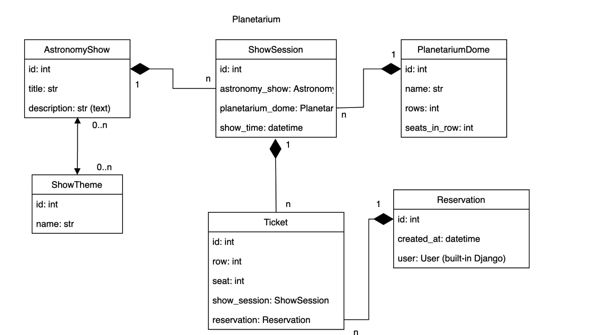

# Planetarium Api

API service for planetarium management written on DRF.

## Features

**Authentication and Authorization**:

* Unauthorized users do not have access to the API. Users need to be authenticated before they can access its features.
* Authorized users (authenticated users) can create reservations with tickets.
* Authorized users can read information about show sessions, planetarium domes, and show themes.
* Admin users have additional privileges to manage information.

**Reservations**:

* Authorized users can create reservations with tickets and show session.

**Read-Only Access**:

* Everyone, including authorized users and admin, is disallowed from deleting information via the API.

**Admin Privileges**:

* Admin users have the authority to manage information within the system. It includes the ability to create and update records related to show sessions, planetarium domes, and show themes.

# Db structure


## Installing using GitHub

Install PostgresSQL and create db

For Windows:
```shell
git clone git@github.com:nyanplague/planetarium-api.git
cd planetarium-api
python -m venv venv
source venv/Scripts/activate
pip install -r requirements.txt
set DB_HOST=<your db hostname>
set DB_NAME=<your db hostname>
set DB_USER=<your db hostname>
set DB_PASSWORD=<your db hostname>
python manage.py migrate
python manage.py loaddata planetarium_db_data.json
python manage.py runserver
```
For Mac (and Linux):
```shell
git clone git@github.com:nyanplague/planetarium-api.git
cd planetarium-api
python -m venv venv
source venv/bin/activate
pip install -r requirements.txt
set DB_HOST=<your db hostname>
set DB_NAME=<your db hostname>
set DB_USER=<your db hostname>
set DB_PASSWORD=<your db hostname>
python manage.py migrate
python manage.py loaddata planetarium_db_data.json
python manage.py runserver
```

## Run with Docker
Docker should be installed
```shell
docker-compose build
docker-compose up
```
# Getting access through JWT
* create user via api/user/register
* get access token via api/user/token

# Demo
